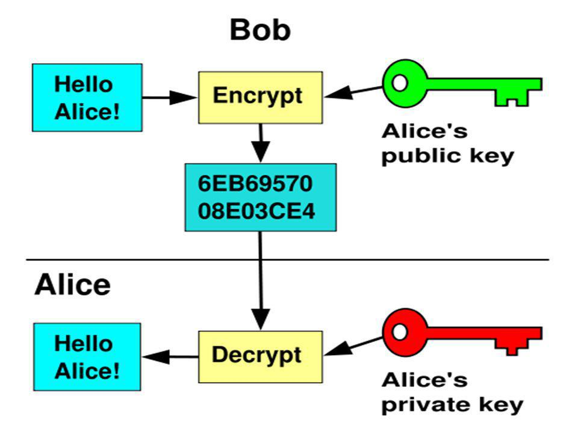

# Welcome to IM!
## DIRECTIONS
:see_no_evil: :hear_no_evil: :speak_no_evil:

I hope you like acronyms, because we use a lot of them :imp:

## Series 1 - Basics
Before we dive into any services let's do a quickly run over some basic
computer stuff you'll need to know. If you miss some of it, don't worry
you'll be able to refer back here later. Also, the whole of the internet is
at your disposal.

### Git :octocat: & Docs :blue_book:
Welcome to your first challange. This should be easy :smiley:
1. Take a look at the resources on
[extra-credit.md](extra-credit.md).
1. Go find one of your own. It can be anyting cool (Good
documentation [Coursera](https://www.coursera.org/),
[Stack Overflow](https://stackoverflow.com), [Github](https://github.com/)).
1. Fork this repository, add your resource, and then make a
pull request.
    * If you need help ask anybody:raising_hand:, and if you finish quickly
    get to know your neighbor (and maybe help them:exclamation:)
1. (optional) make a new github repository and keep all of your code from this series in it, practice makes perfect (and you'll be able to see exactly what you did later)!

If you see more opportunities to contribute to these docs please
feel free. Small improvements build over time and are excelent practice :+1:

### Ravello & VMs :computer:
Hopefully you've got your
[ravello account](https://cloud.ravellosystems.com/) set up.
If not, we'll just use a local VM.

#### Directions
1. Find an [Oracle Linux](https://www.oracle.com/linux/index.html) image
1. Set up and log into your VM!

### OS Basics :shipit:
You're going to get to know linux :sparkles:
 [1]  
Some things we expect you to know:
* How to navigate the filesystem :file_folder: (`cd`, `pwd`, `ls`)
* Users, Groups, and Permissions
* Software & Package Managers (`yum` for Oracle Linux)
* Environmental Variables (especielly the `$PATH`)

#### Directions
1. Open a terminal in your VM
1. Become `root` - `sudo su`
1. Navigate to your home directory - `cd ~`
1. TODO: come up with a good series of steps to assist in learning filesystem permisssions and package managers 

### Linux & Bash
You'll often need to find your way around an unframiliar VM
so understanding how to get the most out of the linux shell will
really give you a head start!
* Useful odds n ends
    * `|` - pipe
    * `curl` / `wget` - download files from the interwebs :globe_with_meridians:
* Find files :page_with_curl:
    * `grep` - search for lines
    * `mlocate` - index and search the filesystem
    * `find` - find files
* Work with files - `vi` :pencil2:
    * `i` - insert mode
    * `:w<Return>` - write
    * `:q<Return>` - quit
    * `/string` - search

Bash will be your friend and so will python.

#### Directions
Each of these steps should be done with one line of code :wink:
1. Download this file from the command line
1. Get the number of lines
1. Find a folder named `advanced_analytics` (if you've installed DVD, else find surprise us)
1. Add an alias to your `~/.bashrc`

### Networking - SSH, Public/Private key encryption, VNC
Hopefully you'll all already be framiliar with these techniques,
and got to use VNC (maybe without knowing it) to log onto your Ravello
instance.  
Public/Private key encryptions is pretty simple when it comes down to it...
Your computer has a private key and the server has a public key. You use your
private key to log into and communicate with the server.

[2] (Image you're Alice and your VM is Bob)
* SSH clients (for Windows - on 'nix it's build in)
    * the standard is [putty](https://www.chiark.greenend.org.uk/~sgtatham/putty/)
    * I prefer [mobaxterm](https://mobaxterm.mobatek.net/)
    * you can also use [cygwin](https://www.cygwin.com/) for ssh
    * or a terminal emulator like [cmder](http://cmder.net/) that comes with cygwin
* Port-Forwarding
* Proxies
* VNC
* SFTP/SCP
#### Directions
1. Download an SSH client of your choice
1. SSH into your VM from above with said client
1. If you did this on clear-guest do this on VPN
1. Use SFTP or SCP to transfer over an `index.html` file
1. Host said file with `python -m SimpleHTTPServer`
1. Use port-forwarding to open up the webpage on `localhost`

### Tools :wrench:
IDE, text editors, DVD
#### Directions
1. Everyone tell us your favorite IDE, text editor, and other devtools
1. Install a good text-editor (if you haven't already)
    * I recommend [vscode](https://code.visualstudio.com/) (I use it for almost everything)
1. Download [Data Visualization Desktop](http://www.oracle.com/technetwork/middleware/oracle-data-visualization/downloads/oracle-data-visualization-desktop-2938957.html)
:bar_chart: It's great for data-exploration and we'll be using this and it's cousin
[Oracle Analytics Cloud](https://cloud.oracle.com/en_US/oac) frequently
1. Download [Oracle SQL Developer](http://www.oracle.com/technetwork/developer-tools/sql-developer/overview/index.html).
If you're on IM or Analytics you'll be using SQLDeveloper often

### Data Management tools on Oracle Cloud
Have you used any of these? Let us know! (Remember,
you can check [cloud.oracle.com](https://cloud.oracle.com/home)
to see the latest portfolio)  
#### Directions
1. Pop quiz - what's the
[difference between OCI and OCI-C](https://stackoverflow.com/q/49633591/5568528)?
1. Pick a service
1. Tell us when & why to use it
1. Give a few of the selling points for this service

## Series 2 - Oracle Cloud Infrastructure (OCI) Storage - Object Store

To get started, check out our [Object Storage Workshop](https://github.com/unofficialoraclecloudhub/InfoManagementNewHireTraining/blob/master/object-storage/ObjectStorageLab.md)

[Oracle's object storage](https://docs.us-phoenix-1.oraclecloud.com/Content/Object/Concepts/objectstorageoverview.htm)  
Object storage is pretty simple - think of it like a filesystem in the cloud.
our object storage infrasctucture is build off of
[OpenStack Swift](https://docs.openstack.org/swift/latest/)* (an
opensource, distributed object/blob store) and we even have our own
[supported version](https://www.oracle.com/linux/openstack/index.html)

*this might only be true in OCI-Classic :grey_question:
#### Directions
1. Make sure you've got an Oracle Cloud account
1. Create a container in Object Storage
1. Get the API endpoints -
    * Authorization
    * REST API
    * Permanent REST API
1. Take a look at the different methods to up/down-load data from storage.
Note the use of acronyms.
    * [OCI-CLI](https://github.com/oracle/oci-cli)
    * [FTMCLI](https://docs.oracle.com/en/cloud/iaas/storage-cloud/csclr/general-syntax-ftm-cli-commands.html#GUID-6E51B750-1958-4FB3-98BB-AF24ECC882D7)
    * [REST API](https://docs.oracle.com/en/cloud/iaas/storage-cloud/ssapi/toc.htm)
    * [Web UI](https://youtu.be/oHg5SJYRHA0)
1. Upload something through the REST API
1. Download that something with the FTMCLI

## Series 3 - DBCS
[Oracle Database](https://en.wikipedia.org/wiki/Oracle_Database)
is unarguably one of the top databases in the world. It also happens to be
Oracle's "bread and butter" so expect to get a lot of requests from customers
to size or demo this.
#### Directions
1. Pick a feature and explain it to us [http://www.oracle.com/technetwork/database/index.html](http://www.oracle.com/technetwork/database/index.html)
1. Now, basics - instantiation, backup, and APEX 
[https://oracle.github.io/learning-library/workshops/dbcs/](https://oracle.github.io/learning-library/workshops/dbcs/)
1. In-memory! :fire: 
[https://oracle.github.io/learning-library/workshops/dbcs-in-memory/](https://oracle.github.io/learning-library/workshops/dbcs-in-memory/)
1. Montor the database and the OS with [dbaas_monitor](https://docs.oracle.com/en/cloud/paas/database-dbaas-cloud/csdbi/access-dbaas-monitor.html)
1. Working with PL/SQL in [Enterprise Monitor](https://docs.oracle.com/en/cloud/paas/database-dbaas-cloud/csdbi/access-em-database-express-12c.html)
1. Create a connection to your database [with SQL Developer](https://docs.oracle.com/en/cloud/paas/database-dbaas-cloud/csdbi/connect-db-using-sql-developer.html)

## Series 4 - ExaData
More Oracle Database!
#### Directions
ExaData environments are hard to get ahold of - and essentially are just 
really powerful Oracle Databases. To give you a better understanding of what 
ExaData is and what we do day-to-day we're just going to present a few videos
our team made about ExaData and show you the Sizing Tool. 
1. (you have to be on VPN for this) see our 
[otube video](https://otube.oracle.com/media/ExaCS+and+OEM/0_l3ul5dzg/3422) 
on ExaData Cloud Service and EM
1. Danny will present to you his video (not on Otube) and the Sizing Tool 

## Series 5 - ADWCS
Once more over Oracle Database.
#### Directions
1. Head over to
[https://unofficialoraclecloudhub.github.io/autonomous-campaign/workshops/adwc-trialcampaigns/](https://unofficialoraclecloudhub.github.io/autonomous-campaign/workshops/adwc-trialcampaigns/)
and follow the instructions! Make sure to ask for help from or give help to your neighbor :wave:

## Series 6 - Advanced Analytics - ORAAH, ORE, ODM, Spatial & Graph
Our team is new to 
[Oracle Advanced Analytics (OAA)](http://www.oracle.com/technetwork/database/options/advanced-analytics/overview/index.html). 
A good reference for the product is a blog post written by Charlie Berger 
[A Simple Guide to Oracle's Machine Leaerning and Advanced Analytics](https://blogs.oracle.com/datamining/a-simple-guide-to-oracle%E2%80%99s-machine-learning-and-advanced-analytics)
OAA is really an umbrella term for a few different products: 
* [Oracle R AA for Hadoop (ORAAH)](http://www.oracle.com/technetwork/database/database-technologies/bdc/r-advanalytics-for-hadoop/overview/index.html)
* [Oracle Data Mining (ODM)](http://www.oracle.com/technetwork/database/options/advanced-analytics/odm/overview/index.html)
* [Oracle R Enterprise (ORE)](http://www.oracle.com/technetwork/database/database-technologies/r/r-enterprise/overview/index.html)
* [Oracle Machine Learning](http://www.oracle.com/technetwork/database/options/oml/overview/index.html)
#### Directions
1.  Head to our workshop and follow the instructions-
[oracle-advanced-analytics](https://sblack4.github.io/oracle-advanced-analytics/workshops/oracle-advanced-analytics)
    

## Series 7 - BDC - Hadoop, Spark, Hive, Zeppelin
:dancer: Oracles Big Data Cloud :raised_hands:
#### Directions
1. Get pumped. Working with BDC is fun :joy:
1. Take a look at the code for [journey2-new-data-lake](https://github.com/millerhoo/journey2-new-data-lake)
    * this is Paul Miller's branch and is typically the most up to date
    * this workshop provides great tips and tricks for working with BDC
    * I refer to this workshop almost every day
1. Visit the github pages site for 
[journey2-new-data-lake](https://millerhoo.github.io/journey2-new-data-lake/workshops/journey2-new-data-lake/?page=README.md)
and follow the instructions to get started!
1. look back at the [github repository](https://github.com/oracle/learning-library/tree/master/workshops/journey2-new-data-lake) there's some interesting files in files folder

## Series 8 - Data Integration - Golden Gate, DIPC, EHCS
What is data integration? To answer this, we are going to give you a challnge. 
Data integration, data engineering, and data wrangling are all hot terms for an array of loosely related activities that share one common goal: to combine data. 

#### Directions
1. Head over to the interweb and find your favorite data repository (I think 
[Kaggle](https://www.kaggle.com/datasets) is cool but 
there's a good 
[list of them](https://github.com/awesomedata/awesome-public-datasets))
and find three datasets from the list below
    - One `json` dataset
    - One `csv` dataset
    - One dataset of another format (`xml`, `html`, `parquet`, `avro` come to minds as ones you want to know about)
1. Using BDC (from Series 8) load that data into [Hive Tables](https://hive.apache.org/) 
1. Connect the data to show something cool (it doesn't need to be revolutionary some of my [favorite statistical facts](http://www.tylervigen.com/spurious-correlations) are spurious)
1. Write a clean, presentable [Zeppelin](https://zeppelin.apache.org/) notebook showing how you did this, with generous use of those cool sql-to-visualization cells
1. Connect your datasource to [DVD](http://www.oracle.com/technetwork/middleware/oracle-data-visualization/downloads/oracle-data-visualization-desktop-2938957.html) and integrate it with yet another datasource with a [Data Flow](https://docs.oracle.com/middleware/bidv1221/desktop/BIDVD/GUID-DC0CDEDF-6F36-45BC-BA8F-E2D3196D5D86.htm#BIDVD-GUID-DC0CDEDF-6F36-45BC-BA8F-E2D3196D5D86) and make a visualization
1. (optional) Deploy [Zeppelin Notebooks on Oracle Database](https://www.progress.com/blogs/using-a-jdbc-driver-with-apache-zeppelin)  
    - (bonus points) [setup authentication](https://zeppelin.apache.org/docs/0.7.2/security/authentication.html)

## Series 9 - Data Science - data retrieval, exploration, cleaning, and model buildling 
Here's we'll do data science applied to a production system, not simply to find cool facts! We saw how easy it is to make a machine learning model, and even run a data pipeline with Oracle Advanced Analytics (Series 6) but now how do we build a *good* machine learning model - and then apply it to new data programmatically?
#### Directions
1.  Log back into your Big Data Console (in BDC) and create a new Zeppelin notebook. 
1. Hopefully you have all gotten a tast of how cool [Apache Spark](https://spark.apache.org/) is.

TODO:: build a cool data science workshop. I'm thinking spark to manipulate data and create model. then python http server to take inputs and return predictions

## Final - Putting it all together - *challange* :grin:
#### Directions
1. TODO:(stuti)

# References
[1] https://twitter.com/Linux/status/936877536780283905

[2] https://en.wikipedia.org/wiki/Public-key_cryptography
